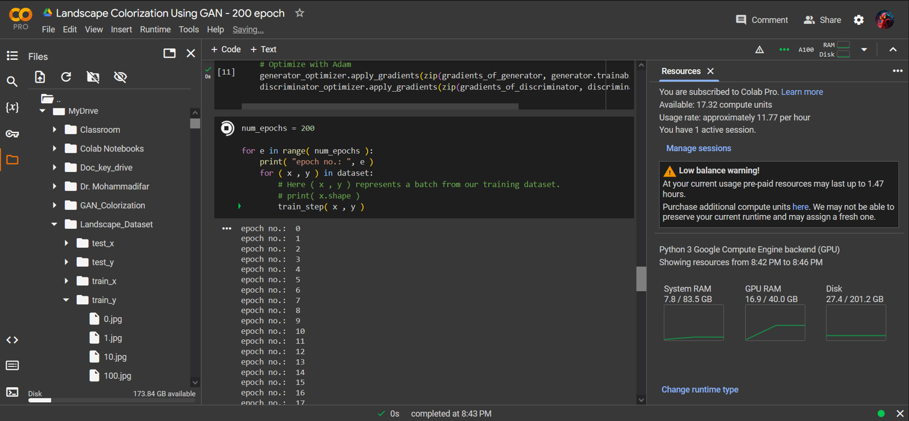
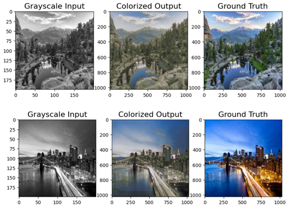
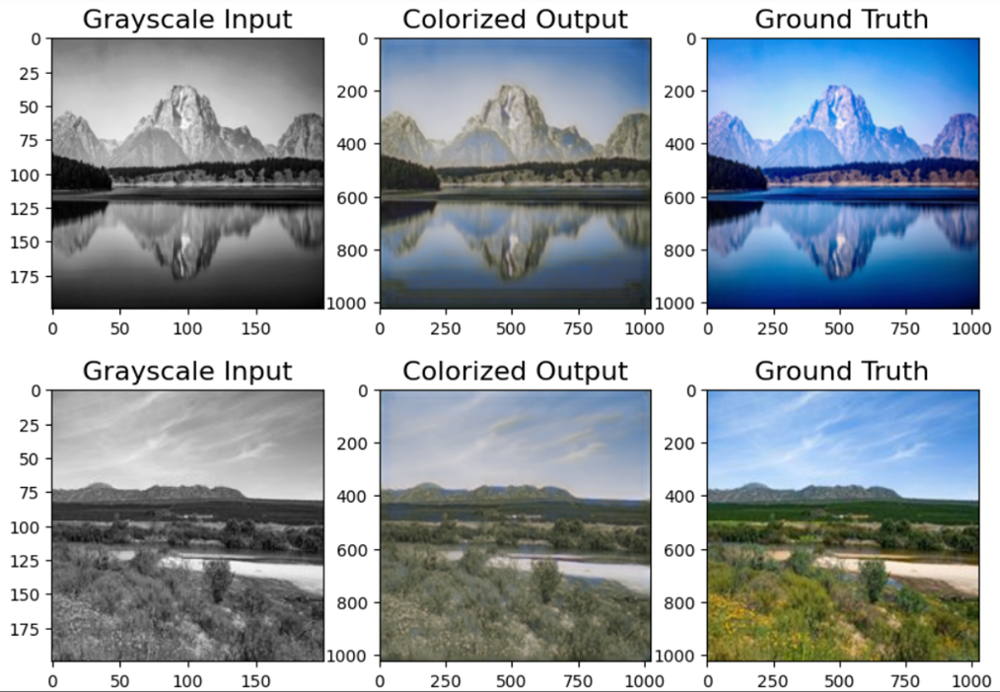

# Image_Colorization_Using_GAN
Colorizing gray scale images.

Image colorization using Generative Adversarial Networks (GANs) has emerged as a powerful method for automatically adding color to grayscale images. In the context of image colorization, the generator's role is to transform a grayscale image into a colorized version, while the discriminator evaluates the authenticity of the generated image against real color images. This adversarial process encourages the generator to produce increasingly realistic outputs, as it learns to minimize the likelihood of the discriminator correctly identifying generated images as fake.

### Here is how I made this dataset through web scraping and then refining it:  
  
1. Scraped images using bing-image-downloader. searched for various categories and saved them in separate folders.  
(there are 10 categories, each containing 100 images)
2. Made a backup  
3. Deleted bad extensions
4. Modified bad modes (converted RGBA transparent images, or gray images, into RGB images)
5. Renamed all images with unique random names.
6. Resized all images to 200*200
7. Made test_y folder: (Transferred 10 random images from each category folder, to a separate folder called test_y)
8. Made train_y folder: (Transferred all the remaining images to a separate folder called train_y)
9. Made test_x folder: (Made grayscale copies of all images of test_y and saved them in the folder test_x)
10. Made train_x folder: (Made grayscale copies of all images of train_y and  saved them in the folder train_x)

The final dataset is accessible through the link below:  
https://drive.google.com/drive/folders/1mS3zGZDpGRYTbPKc19vitHJ4fK08Watx?usp=sharing 

### How is my architecture of GAN designed?
My GAN architecture for image colorization consists of a generator and a discriminator, each designed to work in tandem to produce high-quality colorized images from grayscale inputs. 
The generator employs a series of convolutional layers, progressively increasing the depth of feature maps while reducing spatial dimensions, followed by transposed convolutional layers that upsample the compressed representation back to the original image size. This architecture incorporates skip connections through concatenation layers, allowing the model to retain important spatial details. 
The discriminator, on the other hand, utilizes a series of convolutional layers paired with max pooling to extract features from the input images, ultimately flattening the output to classify images as real or fake via a final dense layer with a sigmoid activation. 
This adversarial training process enhances the generator's ability to create realistic color outputs, while the discriminator becomes adept at distinguishing between real and generated images, leading to improved performance in image colorization tasks.

### Generator Model
The generator model takes a grayscale image as input and outputs a colorized version of the same image. Here's how the architecture is structured: 
1.The input layer accepts a grayscale image with dimensions (image_size, image_size, 1). 
2.The model consists of a series of convolutional layers with increasing depth (16, 32, 64, 128) and decreasing spatial dimensions (5x5, 3x3 kernels). Each convolutional layer is followed by a LeakyReLU activation function. 
3.The bottleneck layer is a convolutional layer with 128 filters, a 3x3 kernel, and a tanh activation function, which compresses the feature maps into a compact representation. 
4.The decoder part of the generator consists of a series of transposed convolutional layers (Conv2DTranspose) that gradually increase the spatial dimensions and decrease the depth of the feature maps. These layers are responsible for upsampling the compressed representation back to the original image size. 
5.Concatenation layers (Concatenate) are used to combine the feature maps from the encoder part of the generator with the corresponding feature maps in the decoder part. This allows the model to preserve spatial information and details from the input grayscale image. 
6.The final output layer is a transposed convolutional layer with 3 filters (corresponding to the RGB channels) and a ReLU activation function, which produces the colorized image.

### Discriminator Model
The discriminator model takes an image (either a real color image or a generated colorized image) and classifies it as real or fake (generated). The architecture of the discriminator is as follows: 
1.The input layer accepts an RGB image with dimensions (200, 200, 3). 
2.The model consists of a series of convolutional layers with increasing depth (32, 64, 128, 256) and decreasing spatial dimensions (7x7, 5x5, 3x3 kernels). Each convolutional layer is followed by a ReLU activation function. 
3.Max pooling layers (MaxPooling2D) are used after every two convolutional layers to reduce the spatial dimensions of the feature maps and introduce translation invariance. 
4.The flattened feature maps are passed through a series of dense layers with decreasing dimensions (512, 128, 16). 
5.The final output layer is a dense layer with a single neuron and a sigmoid activation function, which outputs the probability of the input image being real (1) or fake (0). 

After defining generator and discriminator, this code sets up the necessary components for training a GAN, including the loss functions for the generator and discriminator, the optimizers used for updating the model weights, and the initialization of the generator and discriminator models. The discriminator loss combines binary cross-entropy for real and fake images, while the generator loss uses mean squared error between the generated images and real images. The Adam optimizer is used for both models with a learning rate of 0.0005.

After that, we define the train_step function. The `train_step` function encapsulates the core training logic for a GAN. It generates images, evaluates them, computes losses, calculates gradients, and updates model weights, all while leveraging TensorFlow's capabilities for efficient computation. This iterative process is essential for training the GAN to produce high-quality colorized images from grayscale inputs.

After defining all necessary functions, this code snippet sets up a training loop for a GAN that runs for 200 epochs. During each epoch, it processes batches of training data from the dataset, invoking the train_step function to perform the necessary computations for training the generator and discriminator. This structured approach allows the model to learn from the data iteratively, gradually improving its ability to generate realistic colorized images from grayscale inputs. The print statement provides a simple way to track the progress of training over time.

After the training is done, we save the model for further use.
The generator model can be used as a tool for colorizing images. 

The whole notebook is accessible trough the link below :
https://colab.research.google.com/drive/1GLFR2tBgZQivxuaYk-acbv6dA8yaLuJI?usp=sharing 
The training process was done using colab’s A100 GPU. 
Here is a shot from the training process.

Here are some of the results of our generated color images from the test input. 

